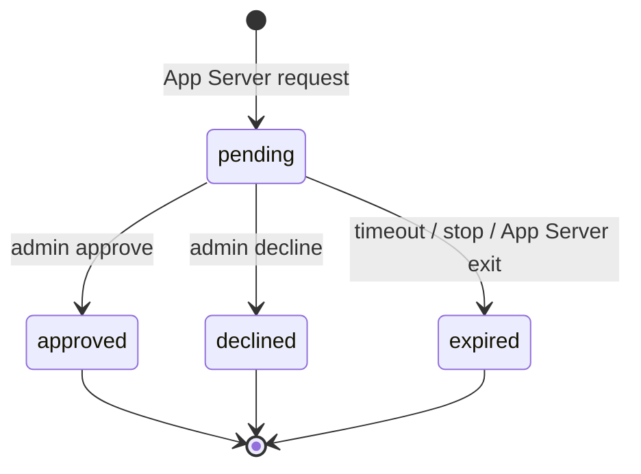

# Phase 5.1 – approval és Federation tool architektúra

## Approval állapotgép



Minden rekord tartalmazza a Bridge run, agent, tartós App Server generation és
provider request azonosítóját. A `(generation, provider_request_id)` egyedi.
Az App Server generation SQLite-ban monoton nő, ezért process-restart után sem
ütközhet egy újrahasznált JSON-RPC request ID egy régi approvallal.

A döntés először tranzakciósan rögzül, utána oldódik fel a memóriában váró
App Server request. Aktív waiter nélkül approval nem hagyható jóvá.

## Dinamikus üzeneteszköz

Az App Server a thread indításakor/resume-jakor ezt kapja:

```text
marveen_agent_message_send(to, content)
```

A modell nem választhat forrásagentet és peert. A Bridge az aktív turn alapján
állítja elő:

| Mező | Forrás |
|---|---|
| peer | agent `federationPeer` konfiguráció |
| from | `config.systemId/active.agentId` |
| to | validált tool argumentum |
| content | validált tool argumentum |
| messageKey/ref | `dynamic:<runId>:<callId>` |

A tool csak durable outboxba ír. A tényleges HTTP-kézbesítést a meglévő
Federation worker végzi retry, lease, deduplikáció és dead-letter szabályokkal.

## Leállási sorrend

1. `runtime.prepareStop()` expire-olja és decline-nal feloldja a pending
   approvalokat.
2. A service leállítja az új HTTP-kéréseket és megvárja az aktív tickeket.
3. A runtime leállítja az App Servert és bezárja a runtime-adatbázist.
4. A service checkpointolja és bezárja a Federation-adatbázist.

Ez megakadályozza, hogy egy approvalra váró turn blokkolja a szolgáltatás
leállását.

## Tudatos korlát

A memóriaeszközök nem részei a Federation v1 szerződésnek. A Marveen belső
SQLite-adatbázisának vagy privát route-jainak közvetlen használata tilos; ehhez
előbb külön, verziózott Federation memory capability szükséges.
